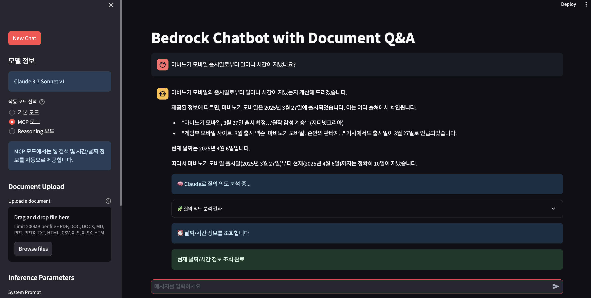

# Claude 3.7 Sonnet MCP 챗봇

## 아키텍처 구성도


## 아키텍처 개요

이 프로젝트는 다음과 같은 AWS 클라우드 아키텍처를 기반으로 배포됩니다:

1. **사용자 접근**: 사용자는 CloudFront를 통해 웹 애플리케이션에 접속합니다.
2. **트래픽 분산**: CloudFront는 트래픽을 Application Load Balancer(ALB)로 전달하고, ALB는 이를 ECS 컨테이너로 분산시킵니다.
3. **챗봇 컨테이너**: ECS에서 실행되는 컨테이너 내부에는:
   - Streamlit 기반의 호스트 앱(app.py)
   - MCP 클라이언트 및 서버 컴포넌트
   - Google 검색 및 날짜/시간 정보 기능
4. **AI 모델**: 챗봇은 Amazon Bedrock의 Claude 3.7 Sonnet 모델을 사용하여 사용자 질의에 응답합니다.
5. **외부 서비스**: MCP 서버는 Google Search API 및 시스템 시간/날짜 기능과 같은 외부 서비스와 통신합니다.


이 프로젝트는 Amazon Bedrock의 Claude 3.7 Sonnet을 사용하여 구현된 지능형 챗봇으로, Model Context Protocol (MCP)를 통해 두 가지 추가 기능을 제공합니다:

1. Google 웹 검색 기능
2. 현재 날짜/시간 정보 제공 기능

## 주요 기능

### LLM 기반 의도 분석 (Intent Analysis)

- Claude 3.7의 추론 능력을 활용하여 사용자 질의의 의도를 분석
- 현재 시간/날짜 정보가 필요한지, 인터넷 검색이 필요한지를 자동으로 판단
- 복합적인 질의(예: "마비노기 모바일이 출시된지 얼마나 지났어?")도 정확하게 분석

### MCP 구조 

#### MCP 호출 흐름

Model Context Protocol(MCP)의 호출 흐름은 다음과 같은 계층 구조로 이루어집니다:


1. **호스트 애플리케이션(app.py)**
   - Streamlit 기반 메인 애플리케이션
   - MCP 클라이언트를 초기화하고 필요시 해당 기능 호출
   - 사용자 질의 의도를 분석하여 적절한 MCP 서비스 선택

2. **MCP 클라이언트**
   - `XXX_mcp_client.py` 파일로 구현
   - 호스트 앱과 MCP 서버 간의 인터페이스 제공
   - 서버 클래스를 인스턴스화하여 기능 호출

3. **MCP 서버**
   - `XXX_mcp_server.py`에서 실제 기능 구현
   - `XXX_mcp.py`는 MCP SDK 기반 서버 인터페이스 제공
   - 비동기(asyncio) 방식으로 구현
   - stdio 기반 통신(`StdioServerTransport` 클래스 사용)

4. **외부 서비스/API**
   - Google Custom Search API, 시스템 날짜/시간 기능 등 실제 서비스

### MCP 구현 기능 설명 
#### 1. Google 웹 검색 기능
- 사용자 질문에서 관련 키워드를 추출하여 Google 검색 API를 통해 웹 검색 수행
- 검색 결과를 가독성 있게 포맷팅하여 모델에게 제공
- 최신 정보에 기반한 답변 제공 가능

#### 2. 날짜/시간 정보 기능
- 날짜/시간 질의에 대해 정확한 정보 제공 (한국어/영어 지원)
- 현재 시간, 날짜, 요일, 경과 일수 등 다양한 정보 제공
- 날짜 간 시간 계산 기능 (예: 특정 일자 이후 경과 시간 계산)

#### 3. 복합 기능
- 검색 결과와 시간 정보를 결합하여 분석
- "출시일로부터 지난 시간" 등의 복합적인 질의에 정확한 응답

### 작동 모드

1. **기본 모드**: 일반적인 AI 챗봇 기능
2. **MCP 모드**: 웹 검색 및 날짜/시간 정보 제공 기능 활성화
3. **Reasoning 모드**: Claude 3.7의 사고 과정(Thinking)을 볼 수 있는 모드

## 설치 및 실행 방법

1. 프로젝트 클론:
   ```bash
   git clone https://github.com/jesamkim/simple-bedrock-chatbot.git
   cd simple-bedrock-chatbot
   ```

2. CDK-deploy 디렉토리로 이동:
   ```bash
   cd CDK-deploy
   ```

3. 가상환경 생성 및 활성화:
   ```bash
   python3 -m venv .venv
   source .venv/bin/activate  # Linux/macOS
   ```

4. 필요한 패키지 설치:
   ```bash
   pip install -r requirements.txt
   ```

5. 환경 변수 설정:
<b>Google 검색 기능을 사용하기 위해 GOOGLE_API_KEY, GOOGLE_SEARCH_ENGINE_ID에 대한 환경변수 등록이 필요합니다.</b>

   ```bash
   export AWS_ACCESS_KEY_ID="your-aws-access-key"
   export AWS_SECRET_ACCESS_KEY="your-aws-secret-key"
   export AWS_REGION="us-west-2"
   
   export GOOGLE_API_KEY="your-api-key-here"
   export GOOGLE_SEARCH_ENGINE_ID="your-search-engine-id-here"
   ```

5-1. 또는 `.env` 파일을 생성해 환경 변수를 관리할 수도 있습니다:
   ```bash
   # .env 파일 생성
   cat > .env << EOL
   AWS_ACCESS_KEY_ID=your-aws-access-key
   AWS_SECRET_ACCESS_KEY=your-aws-secret-key
   AWS_REGION=us-west-2
   GOOGLE_API_KEY=your-api-key-here
   GOOGLE_SEARCH_ENGINE_ID=your-search-engine-id-here
   EOL
   
   # .env 파일 로드
   source .env
   ```

6. CDK 부트스트랩 (AWS 계정/리전에서 최초 1회만 실행):
   ```bash
   cdk bootstrap
   ```

7. CDK 배포 실행:
   ```bash
   cdk deploy
   ```

8. 배포 완료 후 CloudFront URL 확인:
   ```bash
   # 출력 예시
   Outputs:
   cdk-chatbot-claude3.CloudFrontDistributionURL = xxx2cj9ksuhwvn.cloudfront.net
   ```

9. 생성된 CloudFront URL로 브라우저에서 접속하여 챗봇 사용


## 프로젝트 구조

- `app.py`: 메인 Streamlit 애플리케이션
- `google_search_mcp_server.py`: Google 검색 API 기능 구현
- `google_search_mcp_client.py`: Google 검색 클라이언트
- `google_search_mcp.py`: 검색 MCP 구현
- `datetime_mcp_server.py`: 날짜/시간 정보 서버 구현
- `datetime_mcp_client.py`: 날짜/시간 정보 클라이언트

## 사용 방법

1. 좌측 사이드바에서 원하는 모드 선택 (MCP 모드 권장)
2. MCP 모드에서는 질문하면 자동으로 모델이 필요한 정보(웹 검색/시간)를 판단하여 사용
3. 질문 예시:
   - "지금 몇 시야?"
   - "마비노기 모바일이 출시된지 얼마나 지났어?"


## 스크린샷

### 챗봇 실행 화면
문서 업로드 및 Q&A 챗봇 인터페이스:




## 참조
- [Streamlit CDK Fargate](https://github.com/tzaffi/streamlit-cdk-fargate.git)
- [AWS Bedrock Workshop](https://github.com/aws-samples/build-scale-generative-ai-applications-with-amazon-bedrock-workshop/)
- [kyopark2014/mcp](https://github.com/kyopark2014/mcp)

## 라이선스
이 애플리케이션은 MIT-0 라이선스를 따릅니다. LICENSE 파일을 참조하세요.
