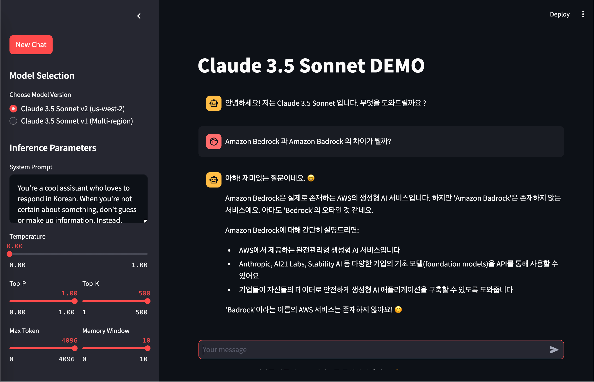

# Amazon Bedrock의 Claude 3.5 Sonnet을 활용한 간단한 Chatbot
Amazon Bedrock (Claude 3.5 Sonnet) &amp; LangChain &amp; Streamlit 으로 구성하는 간단 챗봇 어플리케이션

## 환경
- [중요] AWS 계정에서 anthropic.claude-3-5-sonnet-20240620-v1:0 (Claude 3.5 Sonnet v1) 모델이 us-east-1, us-east-2, us-west-2, ap-northeast-1, ap-northeast-2 리전에 Access Granted 되어 있어야 합니다.
- 각 Claude 3.5 Sonnet 의 RPM (Request per Minute) Quota 가 작은 경우 위의 5개 Region을 순차적으로 순환하면서 API Call 을 수행 합니다.


## 챗봇 실행을 위한 패키지 설치
```
pip install -r ./claude-3-5/requirements.txt -U
```


## streamlit 앱 실행
- AWS Cloud9 환경에서는 터미널에서 아래 실행 후,  상단 메뉴의 Preview > Preview Running Application 에서 streamlit UI를 빠르게 띄울 수 있습니다.
```
streamlit run ./claude-3-5/app.py --server.port 8080
```




#### Reference Contents
> [Bedrock-ChatBot-with-LangChain-and-Streamlit](https://github.com/davidshtian/Bedrock-ChatBot-with-LangChain-and-Streamlit) <br>
> [aws-samples/deploy-streamlit-app](https://github.com/aws-samples/deploy-streamlit-app)
