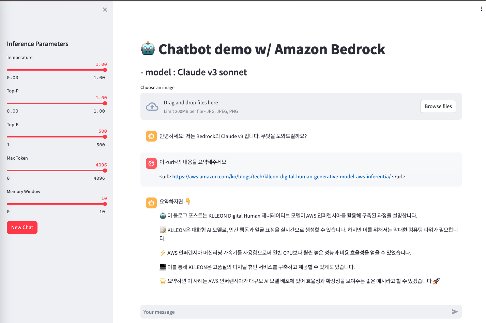

# Bedrock의 Multi Modal을 활용한 간단한 Chatbot
Amazon Bedrock (Claude v3) &amp; LangChain BedrockChat &amp; Streamlit 으로 구성하는 간단 챗봇 어플리케이션

## 환경
- AWS Cloud9에서 수행하는 것을 권장드립니다.
- Bedrock의 Claude에 대한 model access는 설정 되어 있어야 합니다. (이 코드는 us-west-2에서 테스트 했습니다.)
- 코드 상에서 따로 자격증명을 다루지 않습니다. (aws configure 사전 설정 필요)


## langchain 패키지 설치
```
git clone https://github.com/langchain-ai/langchain.git
pip install -e langchain/libs/langchain
```

## 챗봇 실행을 위한 패키지 설치
```
pip install -r ./claude-v3/requirements.txt
```


## streamlit 앱 실행
- AWS Cloud9 환경에서는 터미널에서 아래 실행 후,  상단 메뉴의 Preview > Preview Running Application 에서 streamlit UI를 빠르게 띄울 수 있습니다.
```
streamlit run ./claude-v3/chatbot_app.py --server.port 8080
```




#### Reference Contents
> [Bedrock-ChatBot-with-LangChain-and-Streamlit](https://github.com/davidshtian/Bedrock-ChatBot-with-LangChain-and-Streamlit) <br>
> [aws-samples/deploy-streamlit-app](https://github.com/aws-samples/deploy-streamlit-app)