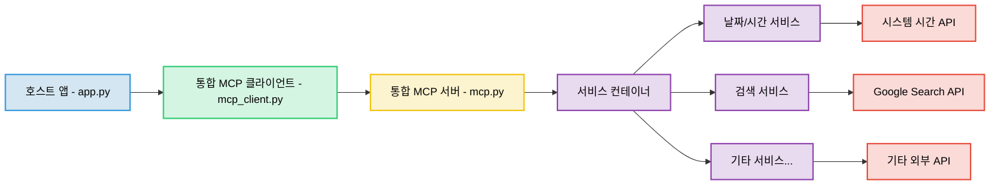

# Simple Bedrock Chatbot

Amazon Bedrock을 기반으로 한 MCP를 활용한 문서 Q&A 챗봇 프로젝트 입니다.

## 주요 기능

### Amazon Bedrock
- **모델**:
  - **Claude 3.7 Sonnet** (us-west-2 리전)
    - 최신 버전의 Claude 모델 사용
    - 향상된 문맥 이해 및 응답 생성 능력
    - 한국어 응답 생성 최적화
- **Model reasoning 모드** (Claude 3.7 Sonnet)
  - 복잡한 문제 해결을 위한 고급 추론 기능
  - 최대 8,196 출력 토큰
  - Temperature 1.0 고정 및 Top-K/Top-P 비활성화
- **스트리밍 응답**: 실시간 응답 생성 지원
- **문서 처리**: 다양한 형식의 문서 파일 처리 및 텍스트 추출
- **모델 파라미터 제어**:
  - Temperature 조절을 통한 응답 다양성 제어
  - Top-P, Top-K를 통한 토큰 샘플링 최적화
  - 최대 토큰 수 제한으로 응답 길이 조절

### Model Context Protocol (MCP) 기능
- **실시간 정보 접근**: AI 모델이 외부 서비스와 상호작용할 수 있는 프로토콜 구현
- **MCP 작동 모드**: 기본 모드와 함께 선택적으로 활성화 가능한 특수 모드

#### MCP 호출 흐름 및 아키텍처
#### MCP 호출 흐름

Model Context Protocol(MCP)의 호출 흐름은 다음과 같은 계층 구조로 이루어집니다:



- **통합 MCP 구조**: 
  - 단일 MCP 서버를 통해 여러 서비스 관리 (`mcp.py`)
  - 통합 클라이언트로 일관된 인터페이스 제공 (`mcp_client.py`)
  - 설정 파일을 통한 서비스 구성 (`mcp_config.json`)
  
- **통신 방식**: 
  - stdio 기반 통신 (`StdioServerTransport` 클래스 활용)
  - Python asyncio를 활용한 비동기 구현

- **파일 구조**:
  - `mcp.py`: 통합 MCP 서버, 여러 서비스 관리 및 도구 요청 라우팅
  - `mcp_client.py`: 호스트 앱에서 사용하는 통합 클라이언트 인터페이스
  - `mcp_config.json`: 서비스 구성 정의 (서비스 이름, 모듈, 클래스, 파라미터)
  - `XXX_mcp_server.py`: 개별 서비스 구현 클래스 (datetime, search 등)

#### 구현된 MCP 서비스
1. **Datetime 서비스**
   - **기능**: 현재 날짜/시간 정보 제공
   - **주요 도구**:
     - `get_current_time`: 현재 시간 정보 반환 (시, 분, 초, 오전/오후 등)
     - `get_current_date`: 현재 날짜 정보 반환 (연, 월, 일, 요일 등)
     - `get_datetime_info`: 종합적인 날짜/시간 정보 제공 (시간대, 경과 시간, 남은 시간 등)
   - **특징**: 한국어 날짜/시간 표기, 시간대 설정(기본: Asia/Seoul), 시간 간격 계산

2. **Google Search 서비스**
   - **기능**: Google Custom Search API를 통한 실시간 웹 검색 결과 제공
   - **주요 기능**:
     - 검색 쿼리 처리 및 결과 반환 (제목, 내용, URL)
     - 텍스트에서 중요 키워드 자동 추출
     - 검색 결과 포맷팅 및 정리
   - **특징**: 최대 결과 개수 조정 가능, 불용어 제거, 빈도 기반 키워드 추출, Google 검색 결과

#### 새로운 MCP 서비스 추가 가이드

아래 가이드를 따라 새로운 MCP 서비스를 추가할 수 있습니다:

1. **서비스 구현**: `XXX_mcp_server.py` 파일 생성
   ```python
   class NewService:
       def __init__(self, param1="default", param2="default"):
           self.param1 = param1
           self.param2 = param2
       
       def some_tool_method(self, arg1, arg2=None):
           # 도구 구현
           return {"result": "..."}
       
       def format_result(self, result):
           # 결과 포맷팅
           return "포맷된 결과..."
   ```

2. **설정 파일 수정**: `mcp_config.json` 파일에 서비스 정의 추가
   ```json
   {
     "services": [
       ...,
       {
         "name": "new_service_name",
         "module": "new_service_mcp_server",
         "class": "NewService", 
         "params": {
           "param1": "value1",
           "param2": "value2"
         }
       }
     ]
   }
   ```

3. **서버 도구 핸들러 확장** (선택적): 새 서비스의 도구가 특수한 처리가 필요한 경우 `mcp.py`의 다음 메서드 수정
   - `_get_service_tools`: 서비스가 제공하는 도구 목록 정의
   - `_handle_list_tools`: 도구 메타데이터 정의
   - `_handle_call_tool`: 도구 호출 처리 로직

4. **클래스 이름 규칙**:
   - 클래스 이름이 mcp_config.json의 "class" 필드와 정확히 일치해야 함
   - 호환성을 위해 필요한 경우 별칭 사용 가능:
     ```python
     class ActualClassName:
         # 구현...
     
     # 설정 파일의 클래스 이름과 일치하는 별칭
     ConfigClassName = ActualClassName
     ```

5. **환경 변수 및 인증**: 필요한 API 키나 인증 정보를 환경 변수로 관리

#### MCP 활용 예시
- **실시간 정보 질의**: "지금 몇 시야?", "오늘 날짜가 어떻게 돼?" 등의 질문에 현재 시간 정보 제공
- **지능형 검색 기반 응답**: 
  - "마비노기 모바일 출시일"과 같은 질의에 Claude가 맥락 이해 후 최적화된 검색 키워드 추출
  - 자연어 질문에서 핵심 키워드를 정확히 식별하여 검색 결과의 정확도 향상
- **복합 질의 처리**: "마비노기 모바일 출시일로부터 얼마나 지났어?" 등 검색과 시간 정보가 모두 필요한 질문 처리

### Amazon Bedrock 특징
- **고성능 LLM 액세스**: 
  - Claude 3.7 Sonnet의 강력한 자연어 처리 능력 활용
  - 문서 내용에 대한 정확한 이해와 관련 정보 추출
  - 맥락을 고려한 응답 생성
- **보안 및 규정 준수**:
  - AWS의 엔터프라이즈급 보안 인프라 활용
  - 데이터 프라이버시 보호
  - IAM을 통한 접근 제어
- **확장성**:
  - 대용량 문서 처리 가능
  - 다양한 문서 형식 지원
  - 실시간 응답 처리

### 지원되는 문서 형식
- **문서 파일**: PDF, DOC, DOCX
- **프레젠테이션**: PPT, PPTX
- **스프레드시트**: XLS, XLSX, CSV
- **텍스트 기반**: TXT, MD, HTML

### 사용자 인터페이스
- **Streamlit 기반** 웹 인터페이스
- 직관적인 문서 업로드 기능
- 실시간 채팅 인터페이스

### 추가 기능
- 시스템 프롬프트 커스터마이징
- 모델 파라미터 조정 (Temperature, Top-P, Top-K 등)
- 메모리 윈도우 크기 조정
- 새로운 채팅 세션 시작

## 설치 방법

1. 저장소 클론
```bash
git clone https://github.com/jesamkim/simple-bedrock-chatbot.git
cd simple-bedrock-chatbot
```

2. 가상환경 생성 및 활성화 (선택사항)
```bash
python3 -m venv venv
source venv/bin/activate  # Linux/Mac

```

3. 필요한 패키지 설치
```bash
cd claude-3-7
pip install -r requirements.txt -U
```

## 실행 방법

```bash
# AWS CLI 설정
aws configure

# 또는 AWS 환경 변수 설정 (AWS 부분은 앞서 aws configure 로 했으면 생략)
export AWS_ACCESS_KEY_ID="your_access_key"
export AWS_SECRET_ACCESS_KEY="your_secret_key"
export AWS_DEFAULT_REGION=us-west-2

# Google API Key 및 Engine ID 는 발급받아서 환경변수로 등록 필요
export GOOGLE_API_KEY="your-api-key-here"
export GOOGLE_SEARCH_ENGINE_ID="your-search-engine-id-here"
```


```bash
streamlit run app.py --server.port 8080
```

## 사용 방법

1. 웹 브라우저에서 `http://localhost:8080` 접속
  
2. 작동 모드 선택
   - **기본 모드**: 일반 챗봇 기능 수행
   - **MCP 모드**: 웹 검색 및 현재 시간/날짜 정보 제공 기능 활성화
   - **Reasoning 모드**: 복잡한 문제 해결에 특화된 사고 과정 활용

3. 사이드바의 "Document Upload" 섹션에서 문서 파일 업로드
   - 지원되는 모든 형식의 파일 업로드 가능
   - 업로드 성공 시 알림 메시지 표시

4. 필요한 경우 추론 파라미터 조정
   - Temperature: 응답의 창의성 조절 (0.0 ~ 1.0)
   - Top-P: 토큰 샘플링 확률 조절
   - Top-K: 고려할 최상위 토큰 수 설정
   - Max Token: 최대 응답 길이 설정
     - Claude 3.7 Sonnet: 기본 최대 8,192 토큰
   - Memory Window: 대화 기억 범위 설정

5. 채팅 입력창에 질문 입력
   - 업로드된 문서 내용을 기반으로 답변 생성
   - MCP 모드에서는 필요시 웹 검색 결과나 날짜/시간 정보 활용
   - 실시간 스트리밍 방식으로 응답 표시

6. 새로 시작하려면 'New Chat' 버튼 클릭

## MCP 기능 상세

### 질의 의도 분석 및 서비스 선택
- **자동 의도 분석**: 입력 텍스트를 분석하여 필요한 MCP 서비스 결정
- **의도 유형**:
  - `datetime`: 날짜/시간 관련 질의 (예: "지금 몇 시야?")
  - `search`: 웹 검색이 필요한 질의 (예: "마비노기 모바일 출시일")
  - `mixed`: 날짜/시간과 검색 모두 필요한 복합 질의 (예: "출시일로부터 얼마나 지났어?")
  - `general`: 특정 패턴이 없는 일반 질의
- **분석 방식**: Claude 3.7 모델을 활용한 고급 의도 분석 및 패턴 매칭 병용

### Datetime MCP 서버 활용
- **시간 정보**: 현재 시간, 오전/오후, 24시간제, 시간대 정보
- **날짜 정보**: 연/월/일, 요일(한국어/영어), 월 이름, 윤년 여부
- **시간 계산**: 오늘 경과 시간, 남은 시간, 올해 경과일, 남은 일수
- **시간대 처리**: 기본 시간대는 Asia/Seoul, 커스터마이징 가능

### Google Search MCP 서버 활용
- **Claude 기반 키워드 추출**: Claude 3.7 모델을 활용한 지능형 검색어 최적화
  - 사용자 질의의 맥락과 의도를 파악하여 최적의 검색 키워드 생성
  - 한국어 질의에서 조사/접미사 제거 및 핵심 키워드 정확히 포착
  - "출시일", "가격" 등 검색 목적을 나타내는 중요 단어 보존
  - NLTK 기반 기존 방식과 비교해 특히 한국어 검색어에서 성능 향상
- **폴백 메커니즘**: Claude API 호출 실패 시 기존 NLTK 기반 키워드 추출로 자동 전환
- **웹 검색**: Google Custom Search API를 통한 최신 정보 검색
- **결과 처리**: 제목, 내용 요약, 출처 URL을 포함한 구조화된 검색 결과 제공
- **결과 통합**: 검색 결과를 기반으로 모델이 종합적인 응답 생성

## 파일 처리 기능

각 파일 형식별 최적화된 처리:

- **PDF 파일**
  - 페이지별 텍스트 추출
  - 이미지 포함 PDF 지원

- **Word 문서 (DOC/DOCX)**
  - 문단 단위 텍스트 추출
  - 서식 정보 제거 및 순수 텍스트 추출

- **파워포인트 (PPT/PPTX)**
  - 슬라이드별 텍스트 추출
  - 도형 및 텍스트 상자 내용 추출

- **엑셀/CSV**
  - 표 형식 데이터를 텍스트로 변환
  - 데이터 구조 보존

- **텍스트 기반 파일**
  - 원본 텍스트 유지
  - 인코딩 자동 감지

## Amazon Bedrock 설정

1. AWS 계정 설정
   - AWS 계정이 필요합니다
   - Amazon Bedrock 서비스 접근 권한 필요

2. IAM 권한 설정
   - Amazon Bedrock 관련 권한 필요:
     - `bedrock:InvokeModel`
     - `bedrock:InvokeModelWithResponseStream`
   - 적절한 IAM 역할 또는 사용자 생성

3. 리전 설정
   - Claude 3.7 Sonnet은 us-west-2 리전으로 사용
   - AWS CLI 또는 환경 변수를 통한 리전 설정

4. 자격 증명 설정
```bash
# AWS CLI 설정
aws configure

# 또는 AWS 환경 변수 설정 (AWS 부분은 앞서 aws configure 로 했으면 생략)
export AWS_ACCESS_KEY_ID="your_access_key"
export AWS_SECRET_ACCESS_KEY="your_secret_key"
export AWS_DEFAULT_REGION=us-west-2

# Google API Key 및 Engine ID 는 발급받아서 환경변수로 등록 필요
export GOOGLE_API_KEY="your-api-key-here"
export GOOGLE_SEARCH_ENGINE_ID="your-search-engine-id-here"
```

## 오류 처리

- 파일 형식별 적절한 에러 메시지 제공
- 파일 처리 실패 시 명확한 피드백
- 임시 파일의 안전한 처리
- API 호출 실패 시 재시도 안내

## 주의사항

1. AWS 자격 증명 설정 필요
   - AWS CLI 설정 또는 환경 변수 사용
   - 적절한 IAM 권한 필요

2. 지원되는 리전 확인
   - Claude 3.7 Sonnet은 us-west-2 리전으로 사용

3. 파일 크기 제한
   - 대용량 파일의 경우 처리 시간이 길어질 수 있음
   - 매우 큰 파일은 분할 처리 권장

4. 모델 특성 이해
   - Claude 3.7 Sonnet: 더 정확한 문맥 이해와 응답 생성, Model reasoning 모드 지원

5. MCP 기능 관련 주의사항
   - 웹 검색 결과는 Google Custom Search API에 의존하며 API 키와 검색 엔진 ID가 필요합니다
   - 날짜/시간 정보는 서버의 시간대 설정에 따라 달라질 수 있음
   - MCP 모드 사용 시 Model reasoning 모드는 비활성화됨

## 스크린샷

챗봇 실행 화면:


## 참조
- [Streamlit CDK Fargate](https://github.com/tzaffi/streamlit-cdk-fargate.git)
- [AWS Bedrock Workshop](https://github.com/aws-samples/build-scale-generative-ai-applications-with-amazon-bedrock-workshop/)
- [kyopark2014/mcp](https://github.com/kyopark2014/mcp)

## 라이선스
이 애플리케이션은 MIT-0 라이선스를 따릅니다. LICENSE 파일을 참조하세요.
